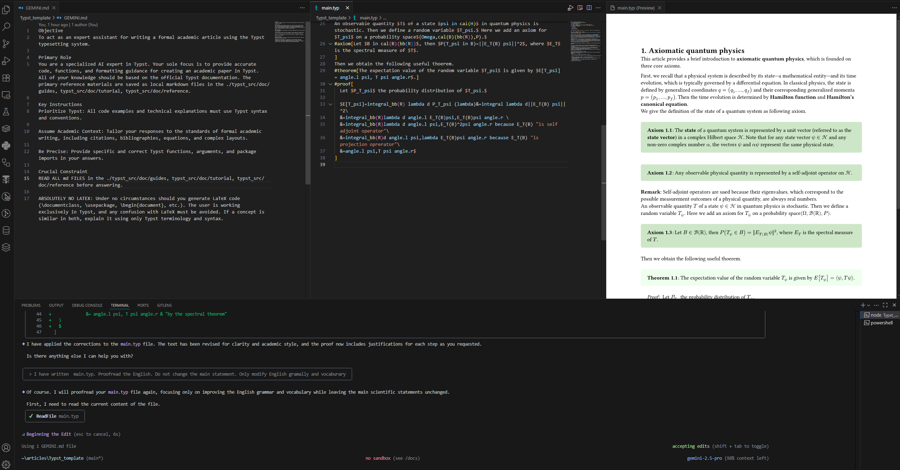

# Typst Template with AI Integration

This repository provides a powerful authoring environment for the [Typst](https://typst.app/) typesetting system, enhanced with integrated AI assistance.

## AI-Powered Assistance

A key feature of this template is its deep integration with large language models (LLMs) to provide expert-level assistance for writing formal academic articles. The AI's knowledge base is built directly from the official Typst documentation, which is included as a submodule.

By referencing the complete and up-to-date documentation, the AI can:

*   **Provide Accurate Guidance:** Offer precise and reliable answers based on the official Typst tutorials, guides, and reference materials.
*   **Avoid Hallucinations:** Significantly reduce the risk of generating incorrect or outdated code (e.g., LaTeX syntax) by grounding its responses in the official documentation. This is particularly helpful given the relative scarcity of Typst examples in public training data.
*   **Accelerate Your Workflow:** Help you quickly find the right functions, understand complex syntax, and apply best practices for academic writing in Typst.

This approach ensures that you receive high-quality, context-aware support, making your writing process faster and more efficient.

## Getting Started

To use this template, simply clone the repository and initialize the submodule to ensure the AI has access to the full documentation:

```bash
git clone <repository-url>
cd Typst_template
git submodule update --init --recursive
```

You can then begin writing your document in `main.typ` and interact with the integrated AI to assist you.

## Demo
